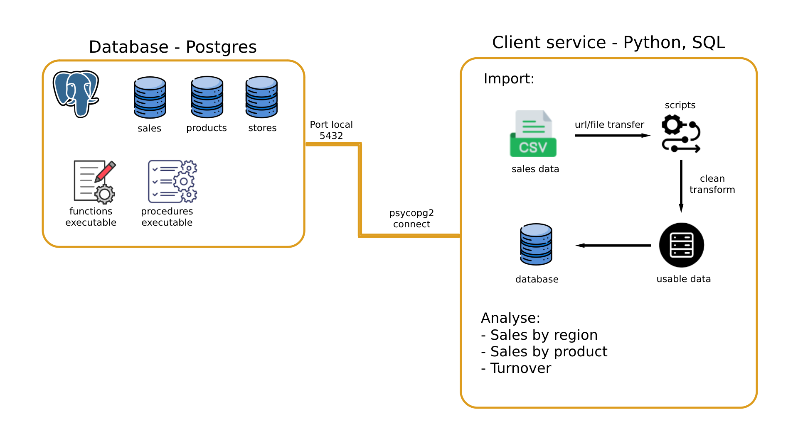
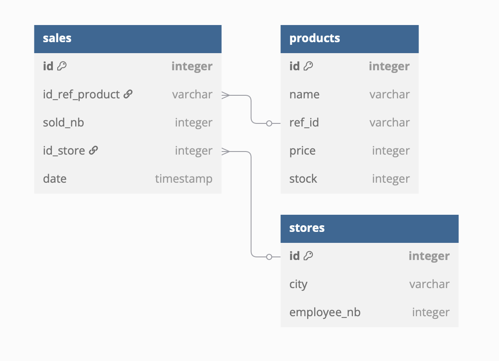

# Brief project SIMPLON

This project provides a PostgresSQL database to analyse the sales of a company based on their data provied with a client service to import, modify and extract data from the database.

## Infrastruture schema


The schema of the infrastruture is shown in the image above.
## Database schema



The schema of the database is shown in the image above.

## Installation

1. Clone the project

```bash
git clone git@github.com:FeedAFish/exercise_simplon.git
```

2. Build Docker Compose

```bash
docker-compose up --build -d
```

## Usage

To open the bash shell of client service, run:

```bash
# Default is client-service
# You can change image name in docker-compose.yml
docker exec -it client-service bash
```

### First run

To create tables inside database:

```bash
# In bash shell of client-service
# 'postgres' is by default
PGPASSWORD=postgres psql -h postgres -U postgres -d postgres -f Scripts/init.sql
```

This command will create all need tables for the database, included:
- **products**: product id, reference, name and stock.
- **stores**: id with city located and number of people who is working there
- **sales**: sales id with date, product reference, store id, number of sold product.
- **sales_by_city**, **sales_by_product**, **turnover** and **total_turnover**: auto update after delete and insert new values into sales table.

### Commands
To receive file by request url (only tested on google sheet):

```bash
# In bash shell of client-service
# Files will be saved in $(cwd)/data/
python get_files_request.py 'your_url'
```

To import from a csv to your database:

```bash
# In bash shell of client-service
# table_name for this project is stores, products and sales
python table_insert_by_csv.py table_name -f 'csv_path'
```

To access sql shell:
```bash
# In bash shell of client-service
# 'postgres' is by default
PGPASSWORD=postgres psql -h postgres -U postgres -d postgres
```

## Results

### Turnover

1. Total turnover is **5268.78**.
2. The product with highest turnover is product with id **REF004** (**1679.79** in total).
3. **REF002** and **REF003** are the 2 lowest in turnover.

### Sales by products

1. **REF005** is the best selling with **35** products sold in total.
2. **REF003** has **15** products sold, which is the lowest, during this period.

### Sales by region (city)

1. **Marseille** leads the board with **27** products sold.
2. **Lille** and **Strasbourg**'s shops are not having good time with **7** and **11** in number of sales respectively.

## Data URLs

1. [Products](https://docs.google.com/spreadsheets/d/e/2PACX-1vSawI56WBC64foMT9pKCiY594fBZk9Lyj8_bxfgmq-8ck_jw1Z49qDeMatCWqBxehEVoM6U1zdYx73V/pub?gid=0&single=true&output=csv)
2. [Stores](https://docs.google.com/spreadsheets/d/e/2PACX-1vSawI56WBC64foMT9pKCiY594fBZk9Lyj8_bxfgmq-8ck_jw1Z49qDeMatCWqBxehEVoM6U1zdYx73V/pub?gid=714623615&single=true&output=csv)
3. [Sales](https://docs.google.com/spreadsheets/d/e/2PACX-1vSawI56WBC64foMT9pKCiY594fBZk9Lyj8_bxfgmq-8ck_jw1Z49qDeMatCWqBxehEVoM6U1zdYx73V/pub?gid=760830694&single=true&output=csv)

## License

This project is licensed under the [MIT License](LICENSE).